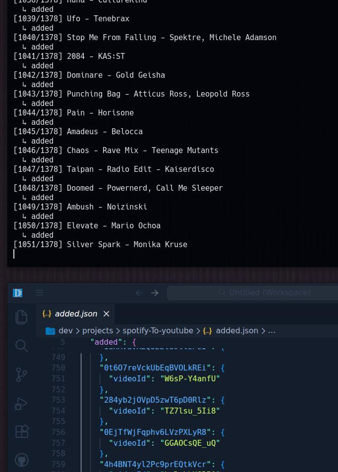

# Spotify to YouTube Music

Minimal script to import a Spotify playlist (CSV export) into YouTube Music.

Built for personal use to move large playlists without paid services.

---

> **Note**
>
> This worked perfectly **in my case** to import **1300+ songs** from Spotify into YouTube Music.
> Different setups or accounts may behave slightly differently, but the overall flow should still work.
>
> Some online services do this too, but many are limited to ~500 tracks unless you pay.
>
> **How it works (short):**
> The script reads the Spotify CSV, searches each track on YouTube Music using title, artist, album and ISRC,
> selects the best match using a simple score, adds it to the playlist and saves progress locally.
> This allows safe resume if the process stops.
>
> In my case, around **40 tracks didn't match** out of ~1370.
> That's still a solid result. Matching can be improved by adjusting regex or metadata handling.
>
> Auth tokens may expire or change during large imports.
> If that happens, regenerating `browser.json` is usually enough.
>
> Any improvements or contributions are welcome. Hope this helps.

---

## Step 1 – Requirements

* Python 3
* YouTube Music account
* Spotify playlist exported as CSV
  (`Song`, `Artist`, `Album`, `ISRC`)

---

## Step 2 – Install

```bash
python -m venv env
source env/bin/activate
pip install -r requirements.txt
```

---

## Step 3 – Authentication

Generate `browser.json` using your YouTube Music session:

```bash
ytmusicapi browser
```

### Get browser headers (Firefox recommended)

1. Open [https://music.youtube.com](https://music.youtube.com) and log in
2. Open Developer Tools (`Ctrl + Shift + I`)
3. Go to **Network**
4. In the filter box, search for `get?prettyPrint`
5. Select a request with:

   * Status: `200`
   * Method: `POST`
   * Domain: `music.youtube.com`

6. Right click → **Copy → Copy request headers**
7. Paste them into the terminal
8. Press **Ctrl + D**

---

## Step 4 – Run importer

```bash
python import.py "My Playlist.csv"
```

* Creates a playlist using the CSV filename
* Adds tracks progressively
* Progress is saved in `added.json`

---

## Step 5 – Resume import

If it stops (auth expires, network error):

```bash
python import.py "My Playlist.csv"
```

Already imported tracks are skipped automatically.

---

## Optional – Dry run

```bash
python import.py "My Playlist.csv" --dry-run
```

Tests matching without adding songs.

---



---

### Export spotify likes to a csv with spotify-likes-to-csv.py

Instead of using third-party websites, use the included `spotify-likes-to-csv.py` script to generate a clean CSV compatible with the importer.

#### Prerequisites
1.  **Create a Spotify App:**
    * Go to [Spotify Developer Dashboard](https://developer.spotify.com/dashboard).
    * Click **Create app**.
    * Set **Redirect URI** to: `http://127.0.0.1:8888/callback`
    * Check **Web API** under APIs/SDKs.
2.  **Get Credentials:**
    * Copy your **Client ID** and **Client Secret** from the app settings.

#### Usage
1.  Edit `spotify-likes-to-csv.py` and paste your credentials:
    ```python
    CLIENT_ID = 'your_client_id'
    CLIENT_SECRET = 'your_client_secret'
    ```
2.  Install dependencies (if not already installed):
    ```bash
    pip install spotipy pandas
    ```
3.  Run the exporter:
    ```bash
    python spotify-likes-to-csv.py
    ```
    *On the first run, a browser window will open. Accept the permissions to allow the script to read your library.*

**Output:** A file named `spotify_likes.csv` will be created with the correct format (`Song`, `Artist`, `Album`, `ISRC`).

